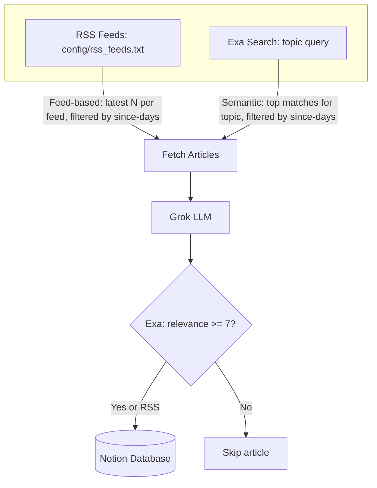

# RSS-to-Notion Knowledge Database

Personal knowledge database with two purposes: (1) accurate, first-principles understanding of how things work, and (2) longitudinal tracking of how real-world situations develop over time. **RSS** keeps track of your interested feeds (sources configurable); **Exa** produces high-relevance materials via semantic search. The LLM layer summarises neutrally and tags ontologically for future clustering.

[](https://www.python.org)
[](https://x.ai)
[](https://developers.notion.com)

## RSS vs Exa: Two Approaches

| Aspect | RSS Mode | Exa Mode |
|--------|----------|----------|
| **Objective** | Keep track of interested feeds | Produce high-relevance materials |
| **Approach** | Feed-based (pull from configured sources) | Semantic search (meaning-based retrieval) |
| **Input** | Feed URLs in `config/rss_feeds.txt` | Search topic (e.g. "ai and datacentre buildout") |
| **Selection** | Latest N articles per feed, within `--since-days` | Top matches for topic, filtered by `--since-days` |
| **Config** | `config/rss_feeds.txt`, `--since-days` | `--topic`, `--since-days` |
| **API** | None (public RSS) | Exa (requires `EXA_API_KEY`) |

RSS pulls from your configured feeds by recency. Exa uses semantic search to surface content that matches the *meaning* of your topic, not just keywords.

## Architecture



## Notion Schema

Create a Notion database with these 13 properties:

| Property        | Notion Type  | Source                          |
|-----------------|--------------|----------------------------------|
| Title           | Title        | article title                    |
| Summary         | Rich text    | LLM summary                      |
| Keywords        | Multi-select | flattened keyword list           |
| Source_URL      | URL          | article url                      |
| Entry_Type      | Select       | LLM entry_type                   |
| Cluster_Tag     | Select       | LLM situation_tag (if non-null) |
| Trunk_Branch    | Rich text    | LLM trunk_branch                |
| Relevance_Score | Number       | LLM relevance_score              |
| Source_Mode     | Select       | "rss" or "exa"                   |
| Feed_Source     | Rich text    | feed name or "exa-search"        |
| Date_Published  | Date         | article published_date           |
| Date_Added      | Date         | utcnow() on first insert         |
| Last_Updated    | Date         | utcnow() on every upsert         |

Share the database with your Notion integration (••• → Add connections).

## Setup

1. **Copy `.env.example` to `.env`** and fill in your values:

   - `NOTION_TOKEN` – Notion integration token
   - `NOTION_DATABASE_ID` – Target database ID (32 chars) or full Notion database URL
   - `GROK_API_KEY` – xAI API key
   - `EXA_API_KEY` – Exa API key (required for `--mode exa` only)

2. **Install dependencies** (Python 3.12):

   ```bash
   pip install -r requirements.txt
   ```

3. **Create the Notion database** with the 13 properties above and share it with your integration.

## Usage

RSS is the default and primary pipeline. Exa is for targeted discovery when researching a specific topic.

| Command                                                | What it does                          |
|--------------------------------------------------------|---------------------------------------|
| `python src/rss_to_notion.py`                          | RSS mode (default), last 2 days       |
| `python src/rss_to_notion.py -i`                       | Interactive: prompts for mode, topic, since-days |
| `python src/rss_to_notion.py --since-days 7`           | RSS, extend lookback window           |
| `python src/rss_to_notion.py --mode exa`               | Exa discovery, default topic          |
| `python src/rss_to_notion.py --topic "X" --mode exa`   | Exa search on custom topic            |

Exa mode limits output to 5 results and only upserts articles with relevance score ≥ 7.

### Interactive mode

Run with `-i` to be prompted instead of passing flags:

```bash
python src/rss_to_notion.py -i
```

Prompts: **Mode** (rss/exa), **Topic** (Exa only), **Since days** (both modes).

```bash
# List Notion databases shared with your integration
python src/rss_to_notion.py --list-databases
```

## GitHub Actions

Run the workflow manually from the Actions tab. Daily run uses RSS only. Configure these secrets:

- `NOTION_TOKEN`
- `NOTION_DATABASE_ID`
- `GROK_API_KEY`

For manual Exa runs, also set `EXA_API_KEY` and optionally `RSS_TOPIC`.

## Troubleshooting

- **Share the database**: Click ••• on the database page → Add connections → select your integration.
- **Database ID**: Run `python src/rss_to_notion.py --list-databases` to list databases.
- **Property names**: Must match exactly (e.g. `Source_URL`, not `Source URL`).
- **Exa mode**: Requires `EXA_API_KEY` in `.env`.

## Future explorations

- Exa `findSimilar` seeding: pass URL of a saved entry to discover related content
- Notion filtered view per `situation_tag` as a chronological tracker
- Weekly digest: new `trunk_branch` entries grouped by domain
- Obsidian export of `trunk_branch` entries as a concept graph

## Screenshots

1. CLI output
2. Notion table view filtered by Cluster_Tag
3. Single Notion entry showing all fields
